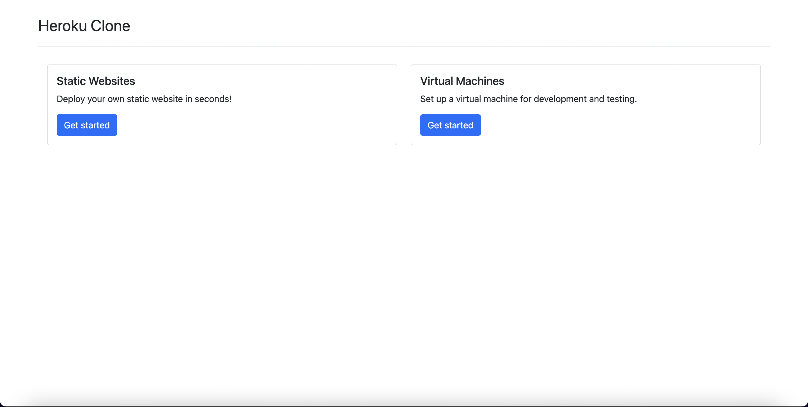
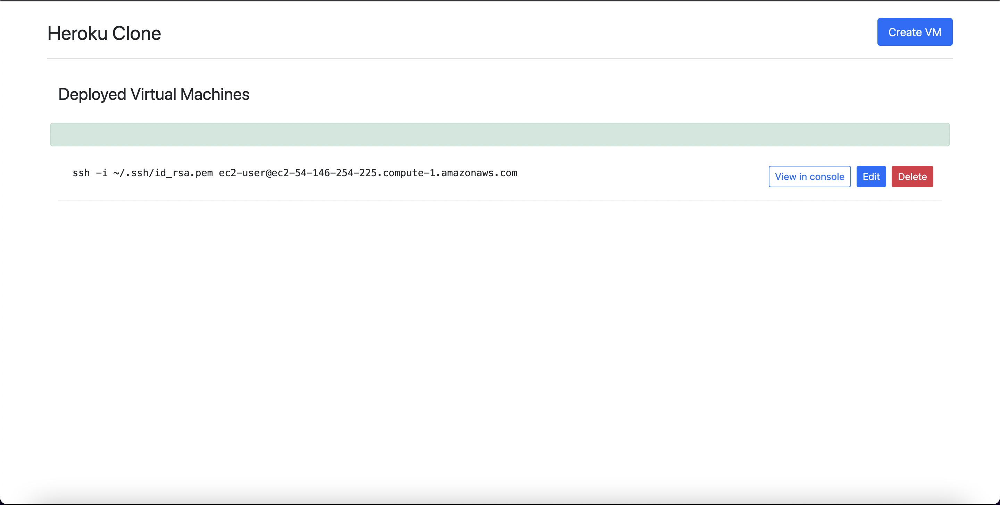
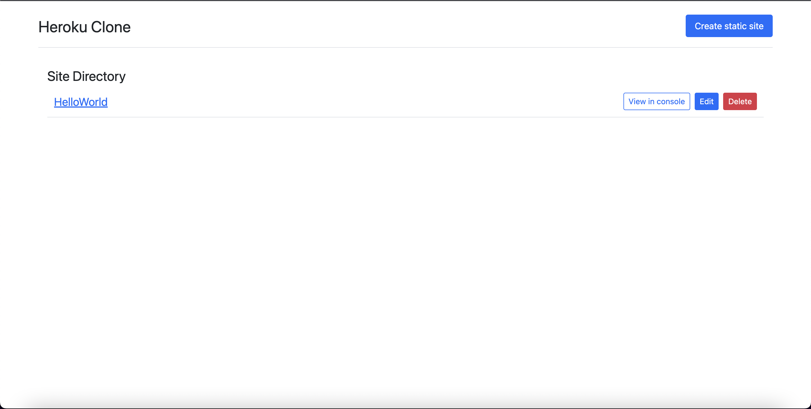

<h1 align="center">Welcome to Heroku-Clone 👋</h1>
<p>
  
  <a href="https://github.com/karnikkanojia/Heroku-Clone/blob/main/README.md" target="_blank">
    
  </a>
  <a href="https://github.com/karnikkanojia/Heroku-Clone/blob/main/LICENSE" target="_blank">
    
  </a>
  <a href="https://twitter.com/KanojiaKarnik" target="_blank">
    
  </a>
</p>

> A minimal AWS Python Pulumi program. Used to create a heroku clone to provision new VMs with flexibility and deploy static websites.

### 🏠 [Homepage](https://heroku-clone-aws.herokuapp.com/)

### ✨ [Demo](https://heroku-clone-aws.herokuapp.com/)

## Install

```sh
pip install -r requirements.txt
```

## Usage

```sh
flask run
```

## Author

👤 **Karnik Kanojia**

* Website: https://karnikkanojia.me
* Twitter: [@KanojiaKarnik](https://twitter.com/KanojiaKarnik)
* Github: [@karnikkanojia](https://github.com/karnikkanojia)
* LinkedIn: [@karnikkanojia](https://linkedin.com/in/karnikkanojia)


## Screenshots



<br>



<br>




## Show your support

Give a ⭐️ if this project helped you!

## 📝 License

Copyright © 2022 [Karnik Kanojia](https://github.com/karnikkanojia).<br />
This project is [GNU GENERAL PUBLIC LICENSE](https://github.com/karnikkanojia/Heroku-Clone/blob/main/LICENSE) licensed.

***
_This README was generated with ❤️ by [readme-md-generator](https://github.com/kefranabg/readme-md-generator)_